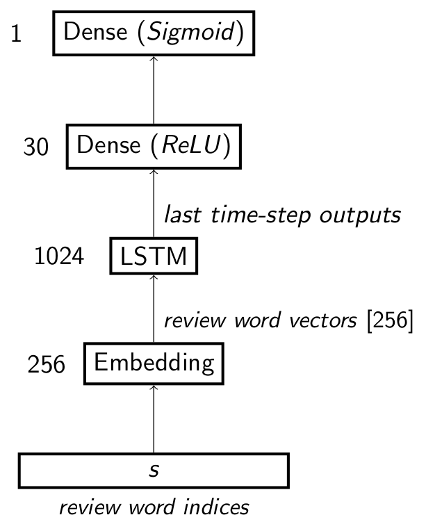
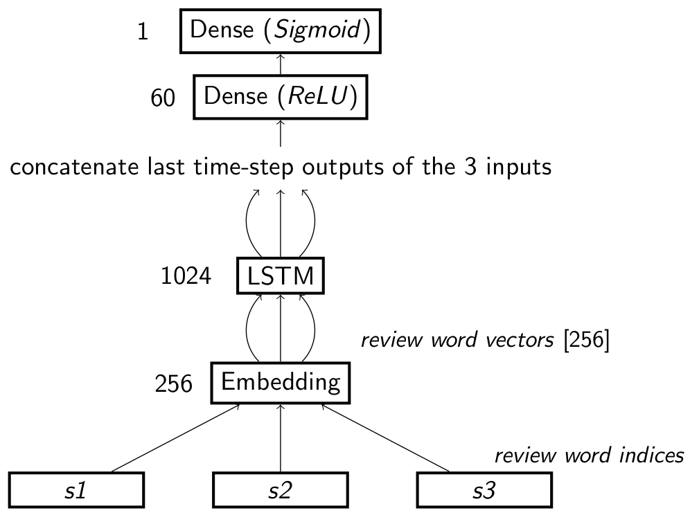

# Adversarial Training Methods
Adversarial and virtual adversarial training methods for semi-supervised text classification.

Based on the paper:
[Adversarial training methods for semi-supervised text classification, ICLR 2017, Miyato T., Dai A., Goodfellow I.
](https://arxiv.org/abs/1605.07725)

**Without the pre-training phase**

## Requirements

Package | Version
:-------: | :-------:
[Python](https://www.python.org/downloads/) | 3.5.4
[Jupyter](http://jupyter.org/install) | 1.0.0
[Tensorflow](https://www.tensorflow.org/versions/r1.5/) | r1.5
[GloVe](https://nlp.stanford.edu/projects/glove/) | 1.2
[NLTK](http://www.nltk.org/install.html) | 3.2.5
[ProgressBar2](https://pypi.python.org/pypi/progressbar2) | 3.34.3
[Matplotlib](https://matplotlib.org/2.1.2/index.html) | 2.1.2
[Argparse](https://pypi.python.org/pypi/argparse/1.1) | 1.1

## Dataset creation

Download the [IMDB](http://ai.stanford.edu/~amaas/data/sentiment/) dataset.

Then we have to do the following steps:
* prepare dataset in order to train GloVe using _glove_training_preparation.ipynb_
* set the vectors length at 256 and remove words appearing in less than 3 reviews in the GloVe training script
* run GloVe training script
* create the embedding matrix (used by the network) and the dictionary (used to convert reviews in sequences of index) using _pretrained_glove_embedding_script.ipynb_
* convert reviews in sequences of index using _dataset_script.pynb_ and _test_dataset_script.ipynb_

## Training

5% of the training set is used for validation

use _paper_network.ipynb_ or _pyramidal_network.ipynb_ according to the network architecture you want to use.

Paper model | Pyramidal model
:---------: | :-------------:
 | 

## Results

Sequences are truncated at 1200 (pyramidal model), 600 and 400 to test the sensitivity of the model to reviews lengths. In particular we cut off or add zero-padding at the initial part of the review.

Method | Seq. Length | Epochs | Accuracy
:------: | :-----------: | :------: | :--------:
baseline | 400 | 10 | 0.906  
adversarial | 400 | 10 | 0.914  
virtual adv. | 400 | 10 | **0.921**
baseline | 600 | 10 | 0.904  
adversarial | 600 | 10 | 0.912  
pyramidal baseline | 1200 | 10 | 0.910  
pyramidal adversarial | 1200 | 10 | 0.916  
