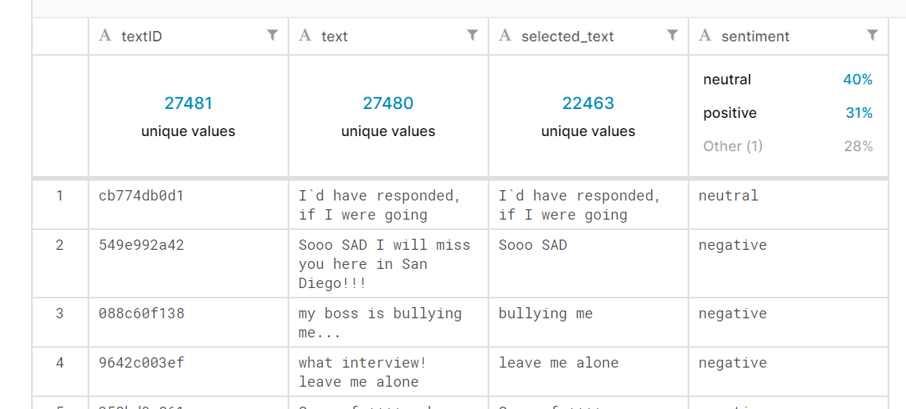

# Tweet-sentiment-extraction
Tweet sentiment extraction是kaggle的一个比赛，这个代码主要是想尝试利用BERT模型实现词语抽取。
其比赛链接：[https://www.kaggle.com/c/tweet-sentiment-extraction/](https://www.kaggle.com/c/tweet-sentiment-extraction)

比赛背景：
在日常的微博传播背后，其情绪会影响公司或者个人的决策。捕捉情绪语言能够立刻让人们了解到语言中的情感，从而可以有效
指导决策。但是,哪些词实际上主导情绪描述，这就需要我们模型能够有效挖掘出来。

比如给定一个句子："My ridiculous dog is amazing." [sentiment: positive]。这个句子的情感为positive(积极)，则比赛需要我们抽取出
能够充分表达这个积极情感信息的词语，比如句子中的“amazing”这个词语可以表达positive情感。

# 1.前言
## 1.1 Required

```
bert-tensorflow
1.15 > tensorflow > 1.12 
tensorflow-hub
```

## 1.2 分析给定的数据
比赛中给定了两个数据集：train.csv和test.csv。利用train.csv数据来构造模型，并预测test.csv数据。

train.csv的具体数据结构如下：



- textID: 文本id
- text： 原始文本
- selected_text： 抽取出来的，带有情感的文本
- sentiment：句子的情感

## 1.3 构造模型输入和输出
初步想法是把“text”和“sentiment”进行拼接，构造成"[CLS] text_a [SEP] text_b [SEP]"。输出是对每个词语进行当前输出，
输出有两个值，分别为0（不需要抽取该词语）和1（需要抽取该词语）。

具体的结构图如下：


# 2.代码实现
## 2.1 预加载模型的下载
首先要新建两个文件夹“bert_pretrain_model”和“save_model”
- bert_pretrain_model: BERT模型下载到这里，并进行解压。具体模型下载连接：
[https://github.com/google-research/bert](https://github.com/google-research/bert)
- save_model: python3 model.py 之后模型会保存到这里

## 2.2 BERT模型文件
BERT模型下载后是一个压缩包，类似于uncased_L-12_H-768_A-12.zip。里面包含了四个文件：
- bert_config.json：BERT模型参数
- bert_model.ckpt.xxxx：这里有两种文件，但导入模型只需要bert_model.ckpt这个前缀就可以了
- vocab.txt：存放词典

## 2.3 构造输入tf.data.dataset
主要实现在[run_classifier_custom.py](./run_classifier_custom.py)

总共构造了7个输入形式：
```python
d = tf.data.Dataset.from_tensor_slices({
    "input_ids":
        tf.constant(
            all_input_ids, shape=[num_examples, seq_length],
            dtype=tf.int32),
    "input_mask":
        tf.constant(
            all_input_mask,
            shape=[num_examples, seq_length],
            dtype=tf.int32),
    "segment_ids":
        tf.constant(
            all_segment_ids,
            shape=[num_examples, seq_length],
            dtype=tf.int32),
    "label_id_list":
        tf.constant(all_label_id_list, shape=[num_examples, seq_length], dtype=tf.int32),
    "sentiment_id":
        tf.constant(all_sentiment_id, shape=[num_examples], dtype=tf.int32),
    "texts":
        tf.constant(all_texts, shape=[num_examples], dtype=tf.string),
    "selected_texts":
        tf.constant(all_selected_texts, shape=[num_examples], dtype=tf.string),
})
```
- input_ids: 把词语进行分词之后，分配的词典id
- input_mask： 可以对哪些位置进行mask操作
- segment_ids： 区分text_a和text_b的id
- label_id_list：标记哪些词语需要被抽取的
- sentiment_id：该句子的情感id
- texts：原始句子
- selected_texts：需要抽取的词语

## 2.4 模型评估
模型评估需要重新恢复构建的词语，代码在[train.py](./train.py)

```python
def eval_decoded_texts(texts, predicted_labels, sentiment_ids, tokenizer):
    decoded_texts = []
    for i, text in enumerate(texts):
        if type(text) == type(b""):
            text = text.decode("utf-8")
        # sentiment "neutral" or length < 2
        if sentiment_ids[i] == 0 or len(text.split()) < 2:
            decoded_texts.append(text)

        else:
            text_list = text.lower().split()
            text_token = tokenizer.tokenize(text)
            segment_id = []

            # record the segment id
            j_text = 0
            j_token = 0
            while j_text < len(text_list) and j_token < len(text_token):
                _j_token = j_token + 1
                text_a = "".join(tokenizer.tokenize(text_list[j_text])).replace("##", "")
                while True:
                    segment_id.append(j_text)
                    if "".join(text_token[j_token:_j_token]).replace("##", "") == text_a:
                        j_token = _j_token
                        break
                    _j_token += 1
                j_text += 1
            assert len(segment_id) == len(text_token)

            # get selected_text
            selected_text = []
            predicted_label_id = predicted_labels[i]
            predicted_label_id.pop(0)
            for _ in range(len(predicted_label_id) - len(text_token)):
                predicted_label_id.pop()

            max_len = len(predicted_label_id)
            assert len(text_token) == max_len
            j = 0
            while j < max_len:
                if predicted_label_id[j] == 1:
                    if j == max_len - 1:
                        j += 1
                    else:
                        a_selected_text = text_list[segment_id[j]]
                        selected_text.append(a_selected_text)
                        for new_j in range(j + 1, len(segment_id)):
                            if segment_id[j] != segment_id[new_j]:
                                j = new_j
                                break
                            elif new_j == len(segment_id) - 1:
                                j = new_j
                else:
                    j += 1

            decoded_texts.append(" ".join(selected_text))

    return decoded_texts
```

## 2.5 train and test
- train
```
python3 train.py
```

- test
```
python3 test.py
```

最后会生成可以提交的csv文件：[submission.csv](./input_data/submission.csv)


